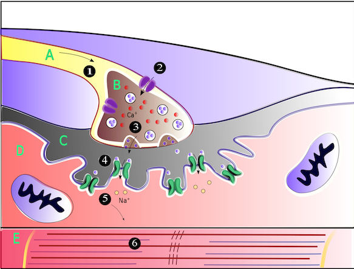

# EC

- 56 year old woman
- Lives alone, not currently employed
- Previously fully independent in ADLs and mobility (until September 2020)

---

# Presenting complaint

- Presented to the QEH Emergency Department in April 2021

--

- Progressive weakness since September 2020
  - Initially in thighs then later in shoulders and arms
  - Associated with cramping and shooting pains in same areas, often after walking
  - Unable to stand for long periods, legs giving way while standing, needs to use her hands to swing her legs out of bed in the morning
  - Can no longer access high shelves
  - Occasional tingling in arms and legs

--

- Constant dizziness since around November 2020
  - Nil vertigo, nil ear pain, nil hearing changes

--

- Weight loss of 10 kg since around November 2020
  - Reduction in appetite
  - Difficulty in swallowing

--

- Low mood

---

# Presenting complaint

- Nil focal infective signs or symptoms
- Nil other systemic symptoms
- Nil sick contacts
- Nil recent medication changes
- Previous MRI brain, CT head + CT lumbar spine, bilateral hip XRs, full body PET by GP unremarkable

---

# Past medical history

- GORD
- Asthma
- Raised peroxidase antibodies noted in 2016 but no formal diagnosis of Hashimoto's thyroiditis
- Right shoulder bursitis
- Chronic neck and back pain with degenerative disc disease
- Anxiety
- Depression
- Insomnia
- Left ovarian cystectomy

---

# Regular medications

- amitriptyline 25 mg nocte
- meloxicam 7.5 mg nocte PRN
- paracetamol 500 mg + codeine 30 mg nocte PRN
- paracetamol 1 g QID
- nitrazepam 5 mg nocte
- budesonide 200 μg + formoterol 6 μg/dose MDI 2 puffs BD PRN
- salbutamol 100 μg/dose MDI 4–6 puffs q4h PRN
- esomeprazole 20 mg daily
- cholecalciferol 1000 units mane
- estradiol pessary 10 μg Monday/Wednesday/Friday
- estradiol 1 mg + estradiol-dydrogesterone 10 mg mane

---

# Substances

- Current pack a day smoker with 40 pack year history (though had been 'vaping' for three months until about a week before presentation)
- Occasional alcohol
- Denies illicit drugs

---

# Family history

- Rheumatoid arthritis (sister only)
- Thyroid disease (mother and sister)
- Nil family history of malignancy

---

# Examination

- **Vitals**: BP 131/100, HR 113, SpO2 97% on RA, afebrile
- **Respiratory**: Chest clear
- **Cardiovascular**: Heart sounds dual with no murmur, peripherally warm and well perfused, nil peripheral oedema, calves soft and non-tender
- **Abdomen**: Soft and non-tender, bowel sounds present
- **Skin**: pityriasis versicolor across upper back, nil other rash
---

# Examination

- **Bulk**: muscle wasting in bilateral proximal arms
- **Tone**: normal in upper and lower limbs bilaterally

.pull-left[
| **Power** | **Right** | **Left** |
|----|-------|------|
| Shoulder abduction | 4/5 | 4/5 |
| Shoulder adduction        | 4/5                   | 4/5|
| Elbow flexion          | 4/5                   | 4/5|
| Elbow extension           | 4/5                   | 4/5|
| Wrist flexion            | 5/5                   | 5/5|
| Wrist extension             | 5/5                   | 5/5|
| Finger abduction         | 5/5                   | 5/5|
| Grip strength    | 5/5                   | 5/5|
]

.pull-right[
| **Power** | **Right** | **Left** |
|----|-------|------|
| Hip flexion              | 3/5                   | 3/5|
| Hip extension               | 3/5                   | 3/5|
| Knee flexion           | 4/5                   | 4/5|
| Knee extension            | 4/5                   | 4/5|
| Ankle dorsiflexion       | 5/5                   | 5/5|
| Ankle plantarflexion    | 5/5                   | 5/5|
| Great toe dorsiflexion  | 5/5                   | 5/5|
| Great toe plantarflexion | 5/5                   | 5/5|
]

   
.center[No improvement in power post exercise]

---

# Examination

- **Reflexes**: 
  - Absent biceps, triceps, brachioradialis, knee jerk, ankle jerk reflexes bilaterally
  - Downgoing plantars bilaterally
- **Coordination**: normal finger-nose test, nil dysdiadochokinesia, normal heel-shin test
- **Sensation**:
  - Intact light touch to upper and lower limbs bilaterally
  - Intact pinprick to upper and lower limbs bilaterally
  - Proprioception intact in upper limbs, absent distal to knees on bilateral lower limbs
- **Cranial nerves** II–XII unremarkable:
  - 2–3 beats non-sustained nystagmus on lateral gaze
  - Minor fatiguability of upward gaze
  - Otherwise normal eye movements with nil diplopia
  - 5/5 power to sternocleidomastoid and shoulder elevation bilaterally
- **Gait**: mildly ataxic
- Normal head impulse test

---

# Initial investigations

- EUC: Na 140, K+ 4.5, urea 2.3, Cr 39, eGFR > 90
- Albumin 41, bilirubin 4, LFTs unremarkable
- CK 38
- CRP 1.0
- CBE: Hb 137, WCC 9.29, platelets 421
- TFTs, Vitamin D, B12, iron studies unremarkable

--

## Tumour markers

- Alpha fetoprotein 2
- CA 125 9
- CA 19-9 7
- CEA 3

---

# Differentials

- LMN (CIDP/Guillain–Barré/Miller Fisher syndrome)
- Limb-girdle muscular dystrophy
- Myositis
- Drug-induced or toxin-induced myopathy
- Malignancy with paraneoplastic syndrome
- Metabolic myopathy
- Polymyalgia rheumatica
- Myasthenia gravis, Lambert-Eaton myasthenic syndrome
- MND/AML

---

# Electromyography and nerve conduction studies

> The sensory responses in the upper and lower limbs are all robust and well within normal limits. Lower limb motor responses are small and distal motor latencies are moderately prolonged, though the feet are cool. There is mild slowing of motor conduction velocity in the right common peroneal nerve. Both tibial F wave responses are within normal latency for her height, though the right was less persistent than expected (30%) and some A waves were seen. **The motor responses in the upper limbs were very small and this was out of keeping with the power on physical examination. This was repeated multiple times with no technical cause identified. The motor response amplitude dramatically increased (> 300%) after 10 seconds of exercise. The phenomenon was observed in both the median-aPB and ulnar-ADM studies.**

---
class: inverse

# Normal physiology of NMJ

.center[]

.footnote[Author: Elliejellybelly1 • CC-BY-SA-4.0 https://creativecommons.org/licenses/by-sa/4.0/deed.en]

---

# Pathophysiology of LEMS

- Autoantibodies directed against pre-synaptic voltage-gated calcium channels (VGCCs)
  - Ten subtypes of VGCCs in humans, defined by α1 subunit
  - P/Q type (named for Purkinje neurones and cerebellar granule cells) comprise >95% of VGCCs at NMJ and are major autoantibody target in LEMS
  - Autoantibody activity against P/Q type VGCCs in the cerebellum may explain ataxia/loss of coordination
- SCLC cell lines have been shown to express P/Q type VGCCs (as well as many other components of the NMJ including ACh receptor subunits)1
- Non-paraneoplastic LEMS is poorly understood, however is associated with other autoimmune conditions including T1DM and immune-mediated thyroid disease 

.footnote[
[1] Benatar M, Blaes F, Johnston I, et al. Presynaptic neuronal antigens expressed by a small cell lung carcinoma cell line. Journal of Neuroimmunology. 2001;(113):153-162.
]

---

# Epidemiology

- Estimates of point prevalence range from 2.3/million (region of the Netherlands1) to 2.6/million (US military veteran population2)
- Typically diagnosed in middle age (58 ± 141)
- May be somewhat more prevalent in males
- At least 50% of LEMS cases are associated with malignancy
- Approximately 3% of SCLC patients will develop LEMS (n = 63)3

.footnote[
[1] Wirtz PW, Nijnuis MG, Sotodeh M, et al. The epidemiology of myasthenia gravis, Lambert-Eaton myasthenic syndrome and their associated tumours in the northern part of the province of South Holland. J Neurol. 2003;250(6):698-70

[2] Abenroth DC, Smith AG, Greenlee JE, Austin SD, Clardy SL. Lambert-Eaton myasthenic syndrome: Epidemiology and therapeutic response in the national veterans affairs population. Muscle Nerve. 2017;56(3):421-426

[3] Payne M, Bradbury P, Lang B, et al. Prospective study into the incidence of Lambert Eaton myasthenic syndrome in small cell lung cancer. J Thorac Oncol. 2010;5(1):34-38.
]

---

# Clinical features

- Progressive proximal muscle weakness
  - Lower limbs > upper limbs
  - Often associated with myalgia
  - Functional decline > loss of power
  - Marked reduction or absence of deep tendon reflexes
  - Paraneoplastic form typically has more rapid progression with more widespread weakness
  - Can progress to diaphragmatic involvement and respiratory failure
- Post-exercise recovery in power and deep tendon reflexes
- Autonomic dysfunction
  - Dry mouth and erectile dysfunction most common reported symptoms; constipation, diarrhoea, postural symptoms, dry eyes, and changes to sweating have also been reported1
  - Pupils may be sluggish

.footnote[
[1] O'Suilleabhain P, Low PA, Lennon VA. Autonomic dysfunction in the Lambert-Eaton myasthenic syndrome: Serologic and clinical correlates. Neurology. 1998;50(1):88-93.
]

---

# Clinical features

- Cranial nerve symptoms less common
 - Typically bulbar symptoms
 - Ocular signs (ptosis, diplopia) much rarer than in MG

---

# Diagnosis

- EMG/NCS
  - Repetitive nerve stimulation (RNS) e.g. 20 Hz for 10 seconds → increase in CMAP > 100% ('postactivation facilitation')
  - Latency and velocity are typically normal
- P/Q type VGCC autoantibody radioimmunoassay
  - 85–95% sensitivity however low specificity; present at varying levels in other conditions including malignancies, paraneoplastic syndromes and MG

---

# Treatment

- Indication for treatment is based on functional impairment; watch and wait may be appropriate for patients with mild symptoms
- Diagnosis and treatment of malignancy is crucial

## Medications

- Amifampridine
  - Presynaptic potassium channel blockade
  - Prolongs presynaptic depolarisation → increased calcium entry
  - Mild adverse effects (headache, nausea, abdominal pain, diarrhoea), can cause seizures at high doses
- Pyridostigmine
  - Of limited benefit
- Guanadine
  - Narrow therapeutic window - nephrotoxicity, bone marrow suppression
- In absence of malignancy, or in treated malignancy: IVIG, prednisolone + azathioprine, rituximab, plasmapheresis

---

# Prognosis

- In paraneoplastic LEMS, malignancy is usually life-limiting factor
  - SCLC typically diagnosed in patients with LEMS ten years earlier than those without1
  - Patients with SCLC and LEMS typically have significantly longer survival than patients without (24 months, 95% CI 7–41 vs 7 months, 95% CI 5–9, n = 1482)
- Life expectancy in non-paraneoplastic LEMS is unchanged

.footnote[
[1] Wirtz PW, Nijnuis MG, Sotodeh M, et al. The epidemiology of myasthenia gravis, Lambert-Eaton myasthenic syndrome and their associated tumours in the northern part of the province of South Holland. J Neurol. 2003;250(6):698-701.

[2]	Wirtz PW, Lang B, Graus F, et al. P/Q-type calcium channel antibodies, Lambert-Eaton myasthenic syndrome and survival in small cell lung cancer. Journal of Neuroimmunology. 2005;164(1-2):161-165.
]
---

# EC

- Subsequent investigation with CT and PET found FDG-avid paraortic lymph node
- Biopsy demonstrated small cell carcinoma
- Commenced on amifampridine
- Commenced on cisplatin and etoposide chemotherapy, has been referred for radiotherapy
