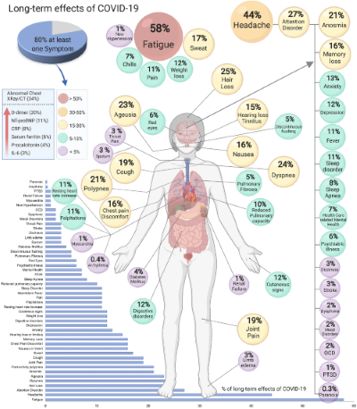

```{r xaringan-themer, include=FALSE, warning=FALSE}
library(xaringanthemer)
style_solarized_light(text_font_size = "1rem")
```

# Outline

- Long COVID and why it matters for General Practice
- Work in progress: scoping review
- Work in progress: ReCEnT data

---

# What is long COVID?

- Long COVID is a patient-created term<sup>1</sup>
- 'Post COVID-19 condition' (WHO case definition):

> Post COVID-19 condition occurs in individuals with a history of probable or confirmed SARS-CoV-2 infection, usually 3 months from the onset of COVID-19 with symptoms that last for at least 2 months and cannot be explained by an alternative diagnosis. Common symptoms include fatigue, shortness of breath, cognitive dysfunction but also others which generally have an impact on everyday functioning. Symptoms may be new onset, following initial recovery from an acute COVID-19 episode, or persist from the initial illness. Symptoms may also fluctuate or relapse over time. A separate definition may be applicable for children.<sup>2</sup>

- (UK NICE definition: 4 weeks = 'ongoing symptomatic COVID-19')

---

# How common is long COVID and what does it look like?

- Prevalance (conditional on acute infection): 2%<sup>3</sup>, or maybe 10%<sup>4</sup>, or even 80%<sup>5</sup> (depending on population, definition, how long after acute infection...)
- As of 2 May 2023: 
  - 438,577 cases in the last 7 days<sup>6</sup>
  - If only 2% develop post COVID symptoms lasting only 2 months: $438,577 \times 2\% \times \frac{60}{7} = 75,185$
- **Fatigue** is most common symptom with the highest QOL burden

---

.center[]

.footnote[Lopez-Leon, S. et al. More than 50 long-term effects of COVID-19: a systematic review and meta-analysis. Sci Rep-uk 11, 16144 (2021).]

---

# Why does this matter to General Practice?

- A new and significant differential for common complaints (fatigue, chronic cough, dyspnoea, vague cognitive symptoms/'brain fog'...)
- For these common complaints, may affect:
  - Presentation (who/when/how many/what symptoms/how morbid)
  - Initial evaluation (process/history/exam/differentials/tests)
  - Management
- ...and need to keep on top of a constantly evolving evidence base

---

# Work in progress: scoping review

- House Standing Committee on Health, Aged Care and Sport held inquiry on long COVID and repeated COVID infections; report 'Sick and Tired: Casting a Long Shadow' handed down April 2023
  - *Patients don't come to see GPs with long COVID; they come with distressing symptoms and signs.* (Prof. Mark Morgan)
  - *A common theme that emerged from the evidence was the need for further research regarding long COVID diagnosis and treatment*
  - *there is no comparable data source describing the prevalence of long COVID seen in primary care*
  - *The feedback that I get from our colleagues is that some people are seeing lots of people with long COVID and some people are seeing very few people with long COVID. I am concerned that people may be being missed* (Prof. Michael Kidd)
  - *It’s a very difficult diagnosis because there’s no easy diagnostic test... That assessment process could be somewhat standardised in terms of the tests that are ordered, the investigations that are covered and the referral pathways that are utilised.* (Prof. Greg Dore)
  
---

# Work in progress: scoping review

- Following the JBI methodology for scoping reviews<sup>7</sup>
- 'Presentation and initial evaluation of patients with potential long COVID in primary care'
  - Population: patients with potential long COVID
  - Concept: presentation (who/when/how many/what symptoms/how morbid) and initial evaluation (process/history/exam/differentials/tests)
  - Context: primary care

---

# Work in progress: scoping review

- Current stage: have developed and submitted protocol for scoping review to JBI Evidence Synthesis
- Next step: once protocol is accepted, can begin review process

---

# Work in progress: ReCEnT data

- ReCEnT = Registrars Clinical Encounters in Training
- Cohort study of registrars in 17 RTOs collecting data from 60 consecutive consultations in a term
- Research questions:
  - How often are GP registrars considering long COVID in patients who present complaining of fatigue?
  - How often are GP registrars diagnosing long COVID in patients who present complaining of fatigue?
  - Do patient demographics affect whether long COVID is considered and diagnosed in patients who present complaining of fatigue?

---

# Work in progress: ReCEnT data

- If fatigue was one of the patient's symptoms: ‘How likely do you think long COVID was the cause of the fatigue?’
  - ‘Didn’t consider long COVID’
  - ‘Very unlikely’
  - ‘Unlikely’
  - ‘Likely’
  - ‘Very likely’
- Age
- Gender

---

# Work in progress: ReCEnT data

- Current stage: collecting S1 2023 data
- Next step: first look at S2 2022 data, EDA and planned analyses

---

# Questions?

1. Callard, F. & Perego, E. How and why patients made Long Covid. Soc Sci Med 268, 113426 (2020).
2. World Health Organisation. A clinical case definition of post COVID-19 condition by a Delphi consensus. (2021).
3. House Standing Committee on Health, Aged Care and Sport, Parliament of Australia. Sick and Tired: Casting a Long Shadow. (2021).
4. Pavli, A., Theodoridou, M. & Maltezou, H. C. Post-COVID Syndrome: Incidence, Clinical Spectrum, and Challenges for Primary Healthcare Professionals. Arch Med Res 52, 575–581 (2021).
5. Lopez-Leon, S. et al. More than 50 long-term effects of COVID-19: a systematic review and meta-analysis. Sci Rep-uk 11, 16144 (2021).
6. World Health Organization. WHO Coronavirus (COVID-19) Dashboard. https://covid19.who.int.
7. The Joanna Briggs Institute. Methodology for JBI Scoping Reviews. in The Joanna Briggs Institute Reviewers’ Manual 2015 (The Joanna Briggs Institute, 2015).
